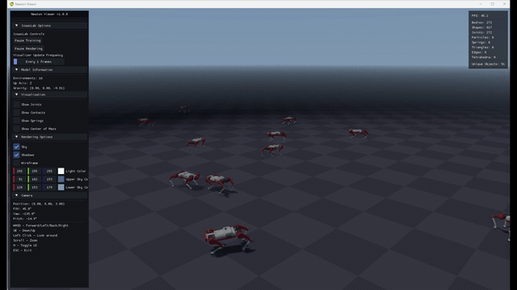
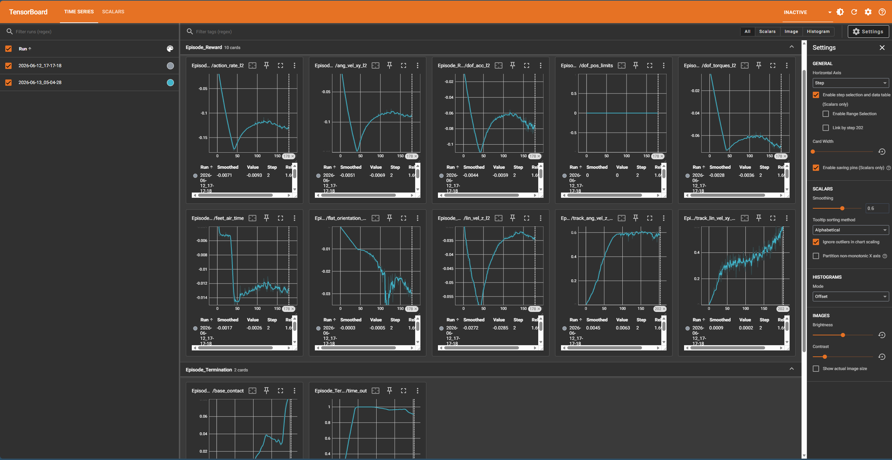

# Trakr Flat Locomotion — Newton Engine (Isaac Lab)

Train a velocity-tracking flat-ground locomotion policy for the **Trakr** quadruped in
**Isaac Lab**, powered by the **NVIDIA Newton** physics engine, and visualize it live with the
**Newton viewer** — no RTX/Omniverse-Kit renderer required.

This repo is a self-contained Isaac Lab task package: robot asset, environment + reward config,
RL agent config, the trained policy, and the setup needed to run it on Isaac Sim 6.0.

## Run it on NVIDIA Brev (one click)

This fork adds a Brev Launchable kit in [`brev/`](brev/): `brev/launchable-setup.sh` (paste into the
Launchable) installs Isaac Lab v3.0.0-beta + Isaac Sim 6.0.0 (pip), pins the Newton stack, and adds
helper scripts so you can **watch the quadruped train live in the browser** (Viser web viewer, port
8080), follow TensorBoard (6006), and optionally open the Newton OpenGL viewer on a noVNC desktop
(6080). GPU choice, console steps, launch parameters and a dry-run checklist:
[`brev/LAUNCHABLE.md`](brev/LAUNCHABLE.md). Attendee guide: [`WORKSHOP.md`](WORKSHOP.md)
(PDF: [`brev/docs/Trakr-Newton-Workshop-Guide.pdf`](brev/docs/Trakr-Newton-Workshop-Guide.pdf)). On the node: `~/trakr_play_web.sh`, `~/trakr_train_live.sh`,
`~/trakr_train.sh`, `~/trakr_train_gl.sh`, `~/trakr_tensorboard.sh`, `~/trakr_play.sh`, `~/trakr_record.sh`
(60 s NVENC clips into `~/outputs/train/` or `~/outputs/play/`), and `~/WORKSHOP.md`.

Verified end to end on a Brev L40S instance on 2026-09-23 (setup ~10 min, see the table in `brev/LAUNCHABLE.md`).

The USD assets and demo video are stored as plain git objects in this fork (upstream uses git-LFS)
so that many Launchable clones do not hit GitHub's LFS bandwidth quota.

---

## Demo



*Trakr flat-ground velocity locomotion — trained end-to-end on the **Newton** backend and rendered
live in the **Newton viewer** (no RTX/Kit renderer). Full-quality clip: [`media/trakr_walk.mp4`](media/trakr_walk.mp4).*

---

## Why Newton

Isaac Lab 3.0 introduces a multi-backend physics architecture. This project trains entirely on the
**Newton** backend (MuJoCo-Warp / MJWarp solver) — selected with the Hydra preset `presets=newton` —
and renders with Newton's built-in OpenGL **viewer** (`--viz newton`). The result: a full
asset → train → play → visualize pipeline that runs without the Omniverse RTX renderer.

| Result (flat, 2048 envs × 300 iters, RTX 3500 Ada laptop) | Value |
|---|---|
| Wall-clock training time | **~251 s (~4 min)** |
| Mean reward | −2 → **~20** |
| Mean episode length | ~480 → **~930** (stays upright) |
| `track_lin_vel_xy_exp` | **1.12** |
| `track_ang_vel_z_exp` | **0.56** |



*TensorBoard episode-reward and termination curves (2048 envs × 300 iters, Newton backend). Reward
climbs −2 → ~20; episode length saturates at the cap by ~iter 50 (stops falling); the velocity-tracking
terms `track_lin_vel_xy_exp` / `track_ang_vel_z_exp` rise steadily — trakr learning to walk.*

---

## The robot

Trakr is a small 12-DoF quadruped (~8.6 kg base, A1-class):

- Articulation root `/trakr`, 17 rigid bodies: `base` + `{FL,FR,RL,RR}_{hip,thigh,shank,toe}`
- 12 revolute joints: `{FL,FR,RL,RR}_{adduction,hip,knee}`
- 17 convex-hull colliders, Z-up, meters

The USD ships in `assets/trakr_robot/`. We use `configuration/robot_physics.usd` (the complete,
collision-bearing config) with the `ArticulationRootAPI` placed on `/trakr` (see *Asset notes*).

---

## Layout

```
trakr-newton-locomotion/
├── trakr_locomotion/            # Isaac Lab task package (registers the Gym tasks on import)
│   ├── trakr_cfg.py             # TRAKR_CFG ArticulationCfg (PD actuators, nominal stance)
│   ├── flat_env_cfg.py          # flat env + Newton/PhysX PresetCfg (njmax tuned)
│   ├── rough_env_cfg.py         # rough-terrain env + body-name mapping
│   ├── __init__.py              # Gym registration
│   └── agents/rsl_rl_ppo_cfg.py # PPO runner config (rsl_rl)
├── assets/trakr_robot/          # the Trakr USD (root-API-fixed)
├── scripts/{train,play}.py      # thin wrappers around Isaac Lab's rsl_rl scripts
├── patches/apply_isaacsim6_compat.py  # required Isaac Lab source fixes for Sim 6.0
├── exported/                    # trained policy: policy.onnx, policy.pt, model_299.pt
├── setup.sh                     # one-shot: pin solver stack + patch + install
└── pyproject.toml
```

Registered tasks: `Isaac-Velocity-{Flat,Rough}-Trakr-v0` and their `-Play-v0` variants.

---

## Requirements

- **Isaac Lab `v3.0.0-beta`** paired with **Isaac Sim `6.0.0`** (developed against `6.0.0-rc.59`).
- An RTX GPU (developed on RTX 3500 Ada Laptop, 12 GB).

> This is a bleeding-edge pairing (beta Lab on an RC Sim). The `setup.sh` step pins the physics
> solver versions and applies two required source patches — see *Compatibility notes*.

---

## Setup

```bash
export ISAACLAB_PATH=/path/to/IsaacLab           # your Isaac Lab v3.0.0-beta checkout
git clone <this-repo> trakr-newton-locomotion
cd trakr-newton-locomotion
ISAACLAB_PATH=$ISAACLAB_PATH bash setup.sh        # pins solver stack, patches, installs package
```

`setup.sh` performs three steps (each idempotent):
1. Pin the Newton solver stack: `newton==1.0.0  mujoco==3.5.0  mujoco-warp==3.5.0.2`
2. Apply Isaac Sim 6.0 compat patches to the Isaac Lab source (`patches/apply_isaacsim6_compat.py`)
3. `pip install -e .` so the Gym tasks register

(Windows: use `isaaclab.bat -p` in place of `./isaaclab.sh -p`.)

---

## Train

```bash
cd "$ISAACLAB_PATH"
./isaaclab.sh -p <repo>/scripts/train.py \
    --task Isaac-Velocity-Flat-Trakr-v0 \
    --headless --num_envs 2048 --max_iterations 300 presets=newton
```

`presets=newton` is **required** (the default PhysX backend is broken on Sim 6.0 — see notes).
Monitor with TensorBoard: `tensorboard --logdir logs/rsl_rl/trakr_flat` → http://localhost:6006.

## Play / visualize (Newton viewer)

```bash
./isaaclab.sh -p <repo>/scripts/play.py \
    --task Isaac-Velocity-Flat-Trakr-Play-v0 \
    --num_envs 16 presets=newton --viz newton
```

`--viz newton` opens Newton's OpenGL viewer — no RTX/kit renderer needed. The trained policy in
`exported/` is loaded automatically (or pass `--checkpoint <path>`).

---

## Compatibility notes (Isaac Lab beta ↔ Isaac Sim 6.0-rc)

`setup.sh` handles all of these; documented here for transparency.

1. **Solver version pin.** Isaac Lab's `--install` resolver pulls newer-than-tested Newton stack
   versions (newton 1.1.0 / mujoco-warp 3.8.1), causing an MJWarp kernel error
   (`update_geom_properties_kernel: geom_dataid expects 1 dim but got 2`). Pin to the tested set:
   `newton==1.0.0  mujoco==3.5.0  mujoco-warp==3.5.0.2`.
2. **`fcntl` import (Windows).** `isaaclab/sim/spawners/from_files/from_files.py` does a top-level
   `import fcntl` (POSIX-only) that crashes all USD spawning on Windows. Patched to a guarded import.
3. **`omni.physics.tensors.impl.api`.** Six runtime modules import this path, but Sim 6.0 ships the
   API at `omni.physics.tensors.api` (no `impl` subpackage). Patched with a try/except fallback.
4. **PhysX backend is broken on Sim 6.0** (the tensor view is invalidated on reset →
   `Failed to get DOF velocities`). This affects every robot, not just Trakr — hence Newton only.
5. **RTX/Kit viewport rendering is broken** on this RC (missing `_rtx_sensors_gmo` DLL). Use the
   **Newton viewer** (`--viz newton`) instead.

## Asset notes

- The source `robot.usd` composes a payload/variant that resolves to a **collision-less skeleton** —
  unusable for contact-based RL. Use `configuration/robot_physics.usd` (complete asset).
- The `ArticulationRootAPI` was relocated from `/trakr/base` (a leaf → 0-DoF articulation) to
  `/trakr` so PhysX/Newton build the full 12-DoF tree. The shipped USD already has this fix applied.
- The PD actuator gains and nominal stance in `trakr_cfg.py` override the (unusable) USD drive values.

## Exported policy

`exported/` contains the trained flat-locomotion policy:
- `policy.onnx` (+ `.data`) — portable actor network for deployment/inference
- `policy.pt` — TorchScript actor
- `model_299.pt` — full rsl_rl checkpoint (for `play.py` / resuming)

> Inference deployment requires reproducing the exact observation/action interface the policy was
> trained on (obs order/scaling, action scale, default joint pose). The policy was trained under
> **Newton**; transferring it to a different physics engine is a sim-to-sim gap.

---

*Developed on Isaac Lab v3.0.0-beta + Isaac Sim 6.0.0-rc.59, RTX 3500 Ada (12 GB), Windows 11.*
