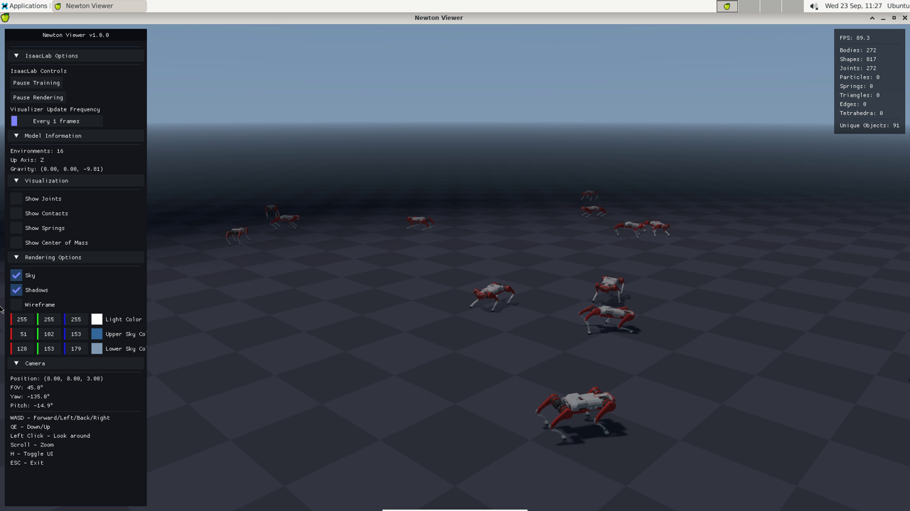
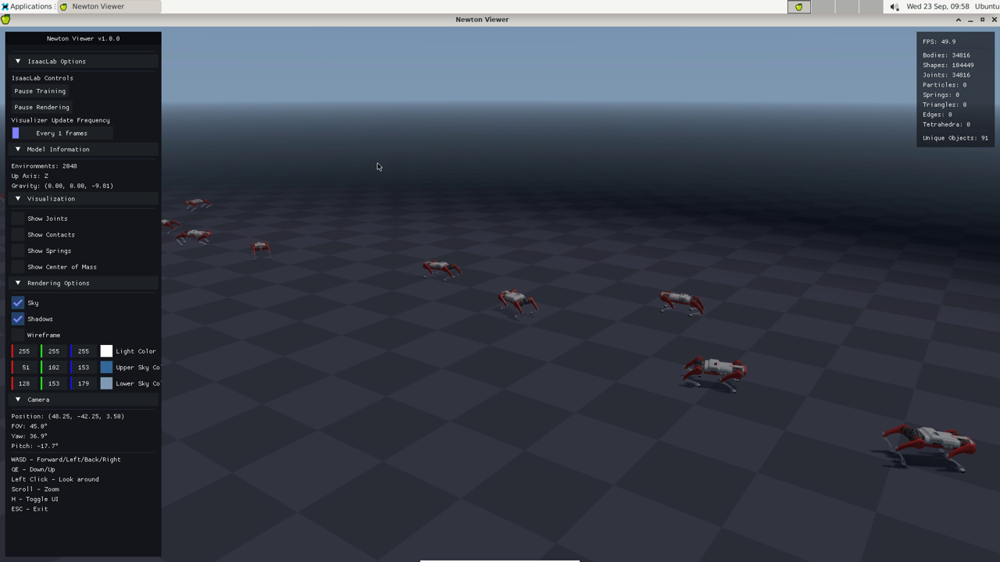

# Trakr learns to walk: Isaac Lab 3.0 + Newton on NVIDIA Brev

Attendee guide. In about 45 minutes you will watch a trained quadruped policy, train your own from
scratch on the GPU, follow the learning curves, compare checkpoints, watch training live, and take a
video clip home. Everything runs on your own cloud GPU instance; you only need a browser.



## 0. Your instance

Your instructor gives you a Brev Launchable link. Deploy it, wait for the setup to finish (about
10 minutes; the console shows the setup log), then open the instance page. You will use:

| Link (Secure Links on the instance page) | Port | What it shows |
|---|---|---|
| **viewer** | 8080 | Viser 3D web viewer: the robots, live in your browser |
| **tensorboard** | 6006 | training curves |
| **desktop** | 6080 | a Linux desktop (noVNC) for the native Newton viewer; password from the instructor |

You also need a terminal on the instance. Either the **Terminal** button on the Brev instance page, or
open the **desktop** link and start *Applications > Terminal Emulator*. All commands below run there.

Helper scripts live in your home directory. `cat ~/WORKSHOP.md` shows a short version of this guide with
the desktop password filled in.

## 1. Watch the trained policy (2 min)

```bash
~/trakr_play_web.sh
```

Wait for the line `Viser server running`, then open the **viewer** link. Sixteen Trakr robots walk with
the policy shipped in the repo (`exported/model_299.pt`). Drag to orbit, scroll to zoom. The robots
follow random velocity commands, so some turn, some walk straight.

Press `Ctrl-C` in the terminal when you are done. The first launch takes about a minute; later ones are
faster.

What just happened: Isaac Lab built 16 copies of the robot in the **Newton** physics engine
(MuJoCo-Warp solver, GPU), ran the policy network at 50 Hz, and streamed the poses to your browser.
No Omniverse renderer was involved; Isaac Lab runs Newton in "kitless" mode here.

## 2. Train your own policy (5 min)

```bash
~/trakr_train.sh 300
```

This trains a new policy with PPO for 300 iterations on 2048 parallel robots, headless. On the L40S it
takes about 1.5 minutes. Watch the console: every iteration prints

```
Mean reward:            climbs from about -2 to above 20
Mean episode length:    climbs to ~990 (the cap; the robots stop falling)
Iteration time:         ~0.5 s
```

Checkpoints are written every 50 iterations to
`~/IsaacLab/logs/rsl_rl/trakr_flat/<date-time>/model_<iteration>.pt`.

Arguments: `~/trakr_train.sh [iterations] [num_envs]`. Try 100 iterations with 4096 envs later and
compare.

## 3. Follow the curves (2 min)

In a second terminal:

```bash
~/trakr_tensorboard.sh
```

Open the **tensorboard** link. Look at `Train/mean_reward`, `Train/mean_episode_length` and the reward
terms under `Episode_Reward/`: `track_lin_vel_xy_exp` (how well the robot follows the commanded
speed) and `track_ang_vel_z_exp` (turning) should rise steadily; `feet_air_time` rewards a real gait.
Leave TensorBoard running; new runs appear automatically.

## 4. Play your own policy (3 min)

Find your run folder, then play its last checkpoint:

```bash
ls ~/IsaacLab/logs/rsl_rl/trakr_flat/
~/trakr_play_web.sh 16 --checkpoint ~/IsaacLab/logs/rsl_rl/trakr_flat/<your run>/model_299.pt
```

Now try an early checkpoint from the same run, `model_50.pt`, and compare how it walks. That is the
difference 250 iterations of PPO make.

## 5. Watch training live (5 min)

You can see the robots while they learn. In the browser:

```bash
~/trakr_train_live.sh 100
```

Open the **viewer** link. Only 16 of the 2048 training robots are drawn (drawing all of them would slow
the viewer to a crawl). In the first iterations they fall over; after about 50 iterations they walk.

Or on the **desktop** link, in the native Newton viewer, with a 60 second video recorded for you:

```bash
RECORD=1 ~/trakr_train_gl.sh 150
```



Live visualisation costs speed: about 1.1 s per iteration instead of 0.5 s. For real training runs use
the headless script from step 2.

## 6. The native Newton viewer and video clips (5 min)

The desktop gives you the Newton OpenGL viewer, which is the fastest and prettiest way to look at the
simulation. Open the **desktop** link (password from your instructor), open a terminal there and run:

```bash
~/trakr_play.sh                # shipped policy, 16 robots
~/trakr_play.sh 64             # more robots
```

Keys: `W A S D` move, `Q E` down and up, left-drag to look around, scroll to zoom, `H` hides the side
panel, `ESC` quits. The panel has *Show Contacts* and *Show Joints* toggles.

The noVNC stream to your browser is limited to a few frames per second, so the picture looks choppy.
The simulation itself runs at 60+ FPS on the GPU. To get a smooth video, record on the instance:

```bash
~/trakr_record.sh              # 60 s of whatever is on the desktop, while the viewer is open
RECORD=1 ~/trakr_play.sh       # or: start play and record 60 s automatically
```

Clips are saved to `~/outputs/play/` or `~/outputs/train/` depending on what was running. Download them
from your laptop with

```bash
scp <instance-ssh-name>:outputs/play/*.mp4 .        # ssh name from "brev ls" / the instance page
```

or with the Brev CLI: `brev copy`.

## 7. Experiments (remaining time)

All of these use the same two commands, train then play.

- **Fewer or more robots.** `~/trakr_train.sh 300 512` versus `~/trakr_train.sh 300 4096`. Watch the
  iteration time and how fast the reward climbs per iteration and per second.
- **Reward shaping.** Edit `~/newton_trakr_brev/trakr_locomotion/flat_env_cfg.py`: the flat config
  sets `flat_orientation_l2.weight = -2.5` (penalises a tilted body) and `feet_air_time.weight = 0.25`
  (rewards lifting the feet). Set `feet_air_time` to 1.0 and retrain: the gait changes visibly. The
  package is installed in editable mode, so a saved file is picked up by the next run.
- **Faster walking.** The command ranges live in Isaac Lab's velocity task config; the flat config only
  overrides rewards and terrain. Ask your instructor if you want to change the commanded speed range.
- **Longer training.** `~/trakr_train.sh 1000` for a smoother gait (about 8 minutes).

Rough terrain (`Isaac-Velocity-Rough-Trakr-v0`) is registered by the repo but does not run on the Newton
backend of this Isaac Lab beta; this workshop uses flat ground.

## 8. What is under the hood

- **Isaac Lab v3.0.0-beta** with its new multi-backend physics. `presets=newton` (already in every
  helper) selects the **Newton** engine, MuJoCo-Warp on the GPU. The default PhysX backend is broken
  on this Isaac Sim 6.0 pairing, which is why the Newton preset is mandatory here.
- **Trakr** is a 12-DoF, 8.6 kg quadruped (A1 class). The robot USD, actuator gains, reward and
  observation config, and the PPO config are in `~/newton_trakr_brev/trakr_locomotion/`.
- **rsl_rl PPO**, 2048 environments, 24 steps per environment per iteration, actor and critic MLPs of
  three 128-unit layers for the flat task.
- **Viewers.** Newton's OpenGL viewer needs the desktop; the Viser viewer is WebGL in your browser;
  both draw only a subset of the training envs.

## Cheat sheet

| Command | What |
|---|---|
| `~/trakr_play_web.sh [n] [--checkpoint p]` | play in the browser viewer (port 8080) |
| `~/trakr_play.sh [n] [--checkpoint p]` | play in the Newton viewer on the desktop |
| `~/trakr_train.sh [iters] [envs]` | headless training, fastest |
| `~/trakr_train_live.sh [iters] [envs] [worlds]` | training with the browser viewer |
| `~/trakr_train_gl.sh [iters] [envs] [worlds]` | training in the desktop viewer |
| `~/trakr_tensorboard.sh` | TensorBoard on port 6006 |
| `~/trakr_record.sh [sec] [name]` | record the desktop to `~/outputs/<train|play>/` |
| `RECORD=1 <play or train_gl helper>` | same, started automatically, 60 s |

Logs: `~/IsaacLab/logs/rsl_rl/trakr_flat/`. Repo: `~/newton_trakr_brev`. Setup log:
`/var/log/trakr-brev-setup.log`.

## If something goes wrong

- **The viewer page is empty.** The simulation has not started yet; wait for `Viser server running` in
  the terminal and reload. If a previous run is still holding port 8080, stop it with `Ctrl-C` or
  `pkill -f play.py`.
- **`FileNotFoundError ... logs/rsl_rl/trakr_flat`.** Play needs a checkpoint; the helpers pass the
  shipped one unless you give `--checkpoint`.
- **`Failed to get DOF velocities`.** You ran Isaac Lab without `presets=newton`. Use the helpers.
- **Desktop is black or does not connect.** In any terminal: `sudo systemctl restart gpu-desktop`, then
  reload the desktop link.
- **Training seems slow.** A viewer is attached. Use `~/trakr_train.sh` (headless) for speed.
- **Out of GPU memory.** Stop other play or training processes first; one L40S handles one 2048-env
  training plus one 16-env play comfortably, not much more.
